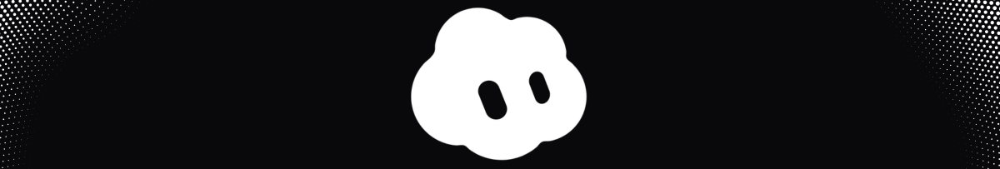

An SVG recreation of the animated bot avatar: **one filled shape** that morphs
between states, **two shapes** for the eyes that morph independently, with customizer,
timeline editor, and export capabilities. No animation library.

## Running it

```bash
npm install
npm run dev
```

Then open http://localhost:5190.

```bash
npm test                # vitest
npm run build           # vue-tsc --noEmit && vite build
npm run electron:dev    # run Electron desktop application
npm run electron:build  # package Windows setup.exe installer + portable app
```

Vue 3, Vite, TypeScript, Tailwind 4, Electron.

## What's in it

The rail switches between three views:

- **Customise**: 16 body shapes, 30 colours, 24 expressions, customizable animated speech bubble with live character limit, and **Avatar Vault** with local persistence and JSON import/export.
- **Animations**: 18 animation states (including `idle`, `bounce`, `pulse`, `spin`, `wave`, `orbit`, `burst`, `comet`, etc.) with a timeline editor to arrange states, durations, and cycles.
- **Settings**: language switcher (English 🇺🇸 / Portuguese 🇧🇷), theme switcher (System / Light / Dark), dynamic ambient glow preview, and project support.
- **Desktop Application (Electron)**: Native cross-platform desktop application with custom draggable titlebar, system tray integration with quick actions, and automated Windows NSIS `setup.exe` installer with custom sidebar banner.

Anything on screen can be exported: the avatar as SVG, PNG, animated SVG, or animated GIF, and full timelines as GIF or MP4 video.

## Using the component

```vue
<BobbyBot
  v-model:block="block"
  v-model:state="state"
  v-model:playing="playing"
/>
<BobbyBot state="orbit" :size="120" :frozen-at="1.2" />
```

`block` is the playback cursor: a montage can play the same state twice, so the
index is what identifies where you are; `state` follows it as an output. Pass
`frozenAt` and the component renders one exact frame with no animation loop, which
is how the thumbnails and the state board are drawn.

Props: `size`, `shape`, `color`, `expression`, `paper`, `frozenAt`, `cycle`,
`follow`, `gaze`. Models: `block`, `state`, `playing`, `elapsed`. See
[BobbyBot.vue](src/components/BobbyBot.vue) for details.

## Documentation

Detailed architecture documents and guides are available in the [`docs/`](docs/) directory:

- [Architecture & Engine Design](docs/architecture.md)
- [Measurements & Geometry Invariants](docs/measurements.md)
- [Desktop Application (Electron)](docs/electron.md)
- [Avatar Vault Persistence](docs/vault.md)
- [Export Pipelines](docs/export.md)
- [Interface & Responsive Layout](docs/interface.md)
- [Internationalization](docs/i18n.md)

## Support the Project

If you find this project helpful or cool, consider supporting:

[](https://buymeacoffee.com/emireln)

## Author & Repository

- Author: **Emir Lima Neto**
- Repository: [https://github.com/emireln/bobby](https://github.com/emireln/bobby) ☁️
- Forked from: [https://github.com/jeremy-prt/bloub](https://github.com/jeremy-prt/bloub) 💯
- Support: [https://buymeacoffee.com/emireln](https://buymeacoffee.com/emireln) 😶‍🌫️

## License

MIT. See [LICENSE](LICENSE).

Not affiliated with, endorsed by or connected to x.ai. It recreates visual
avatar behaviors as an exercise. The MIT licence covers the code in this repository.
